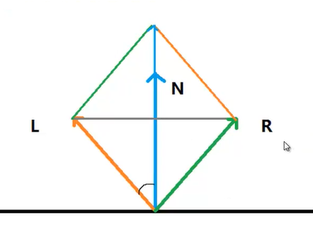

 定义：在兰伯特光照(Diffuse+Ambient)上+镜面反射光(Specular)

---------

###  反射光强度的计算：
利用内置的函数Reflect(I , n)获得反射的向量，再与摄像机的观察向量( 顶点指向摄像机 )做点积得到强度 

其中I是光照方向，可用世界坐标下的顶点坐标减去光源位置
(mul(_Object2World,v.vertex).rgb-_WorldSpaceLightPos0)。也可以用函数WorldSpaceLightDir（v.vertex）来计算，不过这个函数得到的是从顶点指向光源方向，所以我们要取反。记得单位化。

观察向量可以使用内置函数WorldSpaceViewDir(v.vertex)来得到。也可以使用_WorldSpaceCameraPos.xyz-worldPos得到。记得单位化。

法线向量可以使用UnityObjectToWorldNormal( normal )得到。还是记得单位化

计算完之后我们还需要最后一步将得到的数进行一个pow运算，由于我们得到的值介于0~1之间，开方越大它的数值越小，这就意味着我们的高光点越加的集中。开方越小，那么就越接近与漫反射。开方的数可以称为光照衰减(shininess)

最后与原有的颜色值相加

-------------
####  计算反射向量

在不使用reflect的情况下，我们先做如上图。
可知
L+R=XN;   //x为变量
其中cos值设为d/L
L的长度为单位长度
因此蓝线的一半d,为cos也就是dot(L,N)
图示的中间最长的为2dot(L,N)
由于计算完之后的值是一个标量值，因此我们需要将它乘N也就是规范化的normal
最后减去L向量。
也就是2dot(N,L)*N

### shader实践
```
float3 n=normalize(mul(v.normal,_World2Object)).xyz;
float3 l=normalize(_WorldSpaceLightDir);
float3 r=2*dot(l,n)-l;
```
上面的dot操作后并没有使用saturate操作是因为dot操作如果是负的话会转到一个负的方向，使用saturate操作后可能会导致光照不正确。
l也不必取反

------------

衍生：[[BlinnPhong光照]]